<div align="center">

<!-- BANNER: terminal profile.sh --live (FS/SERPENTINE 1-BIT particle portrait + telemetry) -->
<picture>
  <source media="(prefers-color-scheme: dark)"  srcset="assets/banner-dark.svg">
  <source media="(prefers-color-scheme: light)" srcset="assets/banner-light.svg">
  
</picture>

<br/>

<!-- IDENTITY LINE -->
<a href="https://github.com/iam-shivanshu">
  
</a>

<br/>

<!-- IDENTITY PILLS -->
<p>
  
  &nbsp;
  
  &nbsp;
  
  &nbsp;
  
</p>

<br/>

</div>

---

## `> whoami`

I'm a builder who finds the boundary between software and the physical world interesting — and keeps building there.

My projects tend to start with a real problem: a DVR's motion signal going unused, a water tap with no one to remind you to close it, a voice command that should just *work* without a cloud subscription. I reverse-engineer what's available, figure out the minimum hardware to solve it cleanly, and ship it as open source.

Right now I'm deep in **embedded systems** (ESP8266 / Arduino), **IoT automation with Firebase**, and **voice-driven AI interfaces**. I care about work that's deployable on real hardware, not just runnable in a notebook.

<br/>

---

## `> ls ./what-i-build`

<table>
<tr>
<td width="50%" valign="top">

### 🔌 Embedded Systems & IoT
Hardware-first projects that solve real-world problems without unnecessary complexity. One chip, one sensor, one clear purpose.

- Ultrasonic sensing & proximity logic
- Hardware sigma-delta audio (no decoder chips)
- Active-low relay control & boot-safe GPIO
- Single-supply power design (5V/12V)

</td>
<td width="50%" valign="top">

### 🏠 Home & Building Automation
Turning dumb infrastructure into responsive systems — no proprietary hub required.

- CCTV DVR motion → room automation bridge
- Per-room ESP8266 mesh via relay logic
- Firebase Realtime DB remote override
- PWA control panel (works offline)

</td>
</tr>
<tr>
<td width="50%" valign="top">

### 🎙️ Voice & AI Interfaces
Making computers respond to humans naturally — locally when possible, cloud when it matters.

- Offline neural TTS → flash-baked PCM audio
- Speech recognition + LLM response loop
- Ollama (Mistral) local inference
- No-cloud, no-subscription voice systems

</td>
<td width="50%" valign="top">

### ♻️ Conservation & Impact
Building systems that change behaviour through smart feedback — not just monitoring.

- Proximity-triggered water conservation alerts
- Real-time behavioral nudge via audio playback
- Deployable in schools, hostels, public spaces
- Zero connectivity required after deployment

</td>
</tr>
</table>

<br/>

---

## `> cat tech-stack.txt`

**Microcontrollers & Firmware**


**Cloud, Backend & Web**


**AI, Scripting & Tooling**


<br/>

---

## `> ls ./projects --sort=impact`

<br/>

### ⚡ [esp8266-dvr-motion-automation](https://github.com/iam-shivanshu/esp8266-dvr-motion-automation)

> **Turn your existing CCTV DVR's motion detection into an automatic room controller — no new cameras, no proprietary hub.**

An ESP8266 intercepts the DVR's existing motion-detection output and drives relays to control lights or appliances per room. An optional Firebase-backed PWA gives you remote override from anywhere in the world. The whole system costs under ₹500 per room and works with any DVR that exposes motion signals.

**Stack:** `C++ / Arduino` · `ESP8266` · `Firebase Realtime DB` · `HTML/JS PWA` · `Active-Low Relay`

<p>
  
  
  
</p>

---

### 🔊 [esp8266-water-conservation-alert](https://github.com/iam-shivanshu/esp8266-water-conservation-alert)

> **A smart tap reminder that speaks to you. No Wi-Fi, no app, no cloud — just a chip, a sensor, and a speaker.**

An ultrasonic sensor watches a water tap. When someone approaches within 40 cm, a spoken voice message plays: *"Please don't waste water."* The audio is neural-TTS-generated, preprocessed (DC-block, band-limit, soft-limit), and baked into flash as a 16-bit PCM array — no SD card, no MP3 decoder needed. Custom messages take one Python command to swap in.

**Stack:** `C / Arduino` · `ESP8266 Hardware Sigma-Delta` · `Python (PyAV)` · `Neural TTS` · `Offline`

<p>
  
  
  
</p>

---

### 🤖 [chatbot-project](https://github.com/iam-shivanshu/chatbot-project)

> **A fully local voice AI chatbot — speak a question, hear an answer. No API key required.**

Listens via microphone, transcribes with speech recognition, queries Ollama (Mistral) locally, and speaks the response aloud with text-to-speech. Runs entirely on your machine. Say "exit" to stop.

**Stack:** `Python` · `SpeechRecognition` · `Ollama / Mistral` · `pyttsx3` · `100% Local`

<p>
  
  
  
</p>

<br/>

---

## `> git log --stat`

<div align="center">

<picture>
  <source media="(prefers-color-scheme: dark)" srcset="https://github-readme-stats.vercel.app/api?username=iam-shivanshu&show_icons=true&theme=github_dark&hide_border=true&bg_color=0D1117&title_color=58A6FF&icon_color=58A6FF&text_color=C9D1D9&ring_color=58A6FF" />
  <source media="(prefers-color-scheme: light)" srcset="https://github-readme-stats.vercel.app/api?username=iam-shivanshu&show_icons=true&theme=default&hide_border=true&title_color=0969DA&icon_color=0969DA" />
  
</picture>
&nbsp;
<picture>
  <source media="(prefers-color-scheme: dark)" srcset="https://github-readme-stats.vercel.app/api/top-langs/?username=iam-shivanshu&layout=compact&theme=github_dark&hide_border=true&bg_color=0D1117&title_color=58A6FF&text_color=C9D1D9" />
  <source media="(prefers-color-scheme: light)" srcset="https://github-readme-stats.vercel.app/api/top-langs/?username=iam-shivanshu&layout=compact&theme=default&hide_border=true&title_color=0969DA" />
  
</picture>

</div>

<br/>

### Contribution activity

<div align="center">
<picture>
  <source media="(prefers-color-scheme: dark)" srcset="https://raw.githubusercontent.com/iam-shivanshu/iam-shivanshu/output/snake-dark.svg" />
  <source media="(prefers-color-scheme: light)" srcset="https://raw.githubusercontent.com/iam-shivanshu/iam-shivanshu/output/snake.svg" />
  
</picture>
</div>

<br/>

---

## `> cat ./current-focus.md`

```
Currently exploring:
  ├── ESP32 migration (dual-core, Bluetooth, more GPIO)
  ├── MQTT for multi-device IoT coordination
  ├── Whisper-based local speech transcription
  └── Computer vision on edge (OpenCV + Pi)

Open to:
  ├── Collaborations on embedded / IoT projects
  ├── Open-source contributions in hardware + firmware
  └── Discussions on offline-first, local AI systems
```

<br/>

---

## `> cat contact.md`

<div align="center">

<a href="https://github.com/iam-shivanshu">
  
</a>

<br/><br/>

*Building in public. Everything is open source.*

</div>

---

<div align="center">
  <sub>Profile auto-updated · Built with purpose, not templates</sub>
</div>
